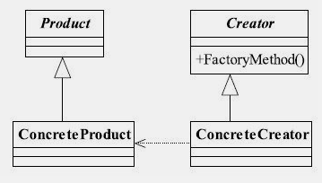
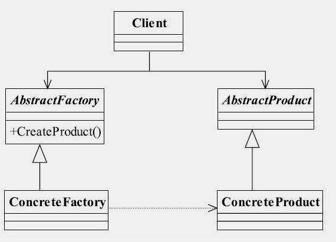
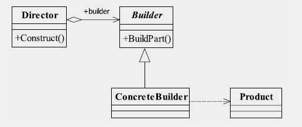
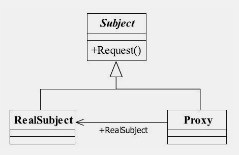
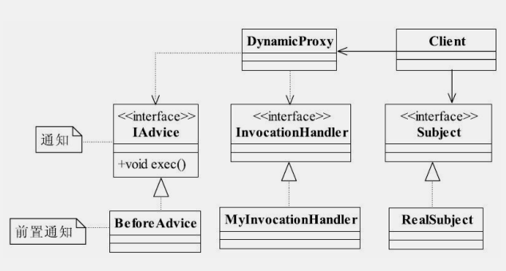
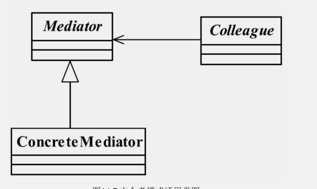
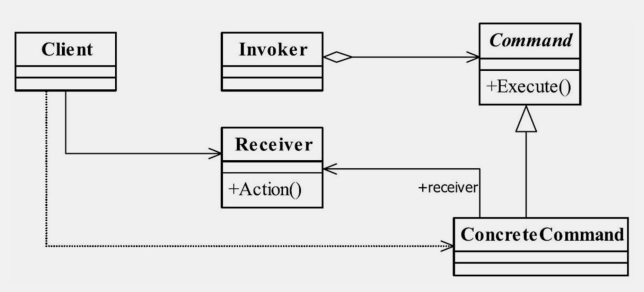

# 设计模式之禅 学习


## 1：6大设计原则


### 1.1 单一职责原则

单一职责原则有以下好处：

- 类的复杂性降低，实现什么职责都有清晰明确的定义
- 可读性提高，复杂性降低
- 可维护性提高，可读性提高
- 变更引起的风险降低

### 1.2 里氏替换原则

**继承的优点：**

- 代码共享，减少创建类的工作量。每个子类都拥有父类的方法和属性
- 提高代码的重用性
- 子类可以形似父类，但又异于父类。
- 提高代码的可扩展性
- 提高产品或项目的开放性

**继承的缺点：**

- 继承是侵入性的

- 降低代码灵活性

- 增加了耦合性

  


 	C++采用多继承的规则，一个子类可以继承多个父类。从整体上，利大于弊，怎么能让利的因素发挥到最大的作用，同时减少弊的麻烦，**解决办法是引入里氏替换原则**。

```java
/*	通俗的讲，只要父类能出现的地方，子类就能出现，而且替换子类也不会产生任何错误异常，或者可能根本就不需要知道是父类还是子类。但是返回来就不行了，有子类出现的地方，父类未必就能适应。
*/
```


### 1.3 依赖倒置原则

依赖的3种写法

​	1 构造函数传递依赖对象

​	2 setter方法传递依赖对象

​	3 接口声明依赖对象


### 1.4 接口隔离原则

​	把一个臃肿的接口更变为两个独立的接口所依赖的原则就是接口隔离原则。通过分散定义多个接口，可以预防未来变更的扩散。


### 1.5 迪米特法则

​	也叫做最少知识原则。通俗的说，一个类应该对自己需要耦合或者调用的类知道的最小。


### 1.6 开闭原则


## 2：23种设计模式


### 2.1 单例模式


#### 定义

> 确保某个类只有一个实例，而且自行实例化并向整个系统提供这个实例

#### 单例模式优点

- 由于内存中只有一个实例，减少了内存开支。特别是一个对象频繁地创建、销毁，且创建销毁时性能又无法优化，单例模式优势很明显。
- 减少了系统性能开销(当一个对象的产生需要比较多的资源时，如读取配置文件、产生其他依赖对象时，则可以通过在应用启动时直接产生一个单例对象，然后永久驻留内存的方式来解决(在JavaEE中采用单例模式需要注意JVM垃圾回收机制))
- 单例模式可以避免对资源的多重占用。
- 单例模式可以在系统设置全局的访问点，优化和共享资源访问。

#### 单例模式的缺点

- 单例模式一般没有接口，扩展困难，如果要扩展，除了修改代码基本上没有第二种途径。

```java
#dd//单例模式为什不能增加接口？
   //因为对接口对单例模式没有任何意义，它要求“自行实例化”，并提供单一实例，接口或者抽象类不可能被实例化
```

- 单例模式对测试不利。
- 单例模式和单一职责原则冲突。`一个类应该只实现一个逻辑，而不关心它是否是单例，是不是要单例取决于环境，单例模式把“要单例”和业务融合在一个类中。`

#### 单例的使用场景

​	在一个系统中，要求类有且仅有一个对象，如果出现多个对象会有“不良反应”，可以采用单例。

- 要求生成唯一序号的环境
- 在整个项目中需要一个共享访问点或共享数据。(WEB页面的计数器，不用每次刷新都记录到数据库中，使用单例模式保持计数器的值，并确保是线程安全的)
- 创建一个对象需要消耗的资源过多`如访问IO和数据库等资源`
- 需要大量定义的静态常量和静态方法(工具方法)的环境中，可以采用单例(也可以直接声明为static)


#### 单例模式的注意事项


```java
---------------------饿汉单例(线程安全)----------------
public class Singleton {
	private static final Singleton singleton = new Singleton();
	// 限制产生多个
	private Singleton() {
	}
	public static Singleton getSingleton() {
		return singleton;
	}
	public static void doSomething() {
	}
}
---------------------懒汉单例(线程不安全)--------------
public class Singleto {
	private static Singleto singleto = null;
	// 限制产生多个对象
	private Singleto() {
	}
	
	public static Singleto getSingleto(){
		if(singleto==null){
			return new Singleto();
		}
		return singleto;
	}
} 
   

```

​	高并发的情况下。懒汉模式存在线程安全问题。

​	如果一个对象执行到了`singleto= new Singleto();` ，但是还没获取到对象(对象初始化需要时间)。第二个线程也执行`singleto==null` ，那么 也会产生一个新对象，因此产生了2个对象。

​	解决线程安全可以使用`synchronized` ，但不是最优秀的单例模式。

​	其次，需要考虑对象复制。对象默认是不可被复制的，若实现了`Cloneable`  接口，通过复制创造一个新对象，对象复制不是通过调用类的构造函数。因此即使使用私有构造函数，对象仍然可以被复制。`解决办法是单例类不要实现Cloneable` 。


#### 单例中允许存在2个对象

```java
public class Emperor {
	// 定义最多能产生的实例数量
	private static int maxNumOfEmperor = 2;
	// 每个皇帝的名字
	private static ArrayList<String> nameList = new ArrayList<String>();
	// 容纳皇帝的实例
	private static ArrayList<Emperor> emperorList = new ArrayList<Emperor>();
	// 当前皇帝的序号
	private static int countNumOfEmperor = 0;

	// 产出所有对象
	static {
		for (int i = 0; i < maxNumOfEmperor; i++) {
			emperorList.add(new Emperor("皇帝" + (i + 1)));
		}
	}

	public static Emperor getInstance() {
		// 随机
		countNumOfEmperor = new Random().nextInt(maxNumOfEmperor);
		return emperorList.get(countNumOfEmperor);
	}

	private Emperor() {

	}

	// 传入名称，建立一个对象
	private Emperor(String name) {
		nameList.add(name);
	}

	public static void say() {
		System.out.println(nameList.get(countNumOfEmperor));
	}
	public static void main(String[] args) {
		int minSnum=5;
		for (int i = 0; i <minSnum; i++) {
			Emperor instance = Emperor.getInstance();
			System.out.print("第"+(i+1)+"个大臣 拜见的是");
			instance.say();
		}
		/*
		 * 第1个大臣 拜见的是皇帝1 
		 * 第2个大臣 拜见的是皇帝1 
		 * 第3个大臣 拜见的是皇帝2 
		 * 第4个大臣 拜见的是皇帝1 
		 * 第5个大臣 拜见的是皇帝2
		 */

	}
}
```


### 2.2 工程方法模式

#### 定义

`定义一个用于常见对象的接口，让子类决定实例化哪一个类。工厂方法使一个类的实例化延迟到其子类`

-------

**工厂类的通用类图**



#### 工厂方法模式优点

```shell
# 1 降低了模块间的耦合。
# 2 工厂方法模式的扩展性非常优秀
# 3 工厂方法模式是典型的解耦框架

```

#### 使用场景

```shell
# 1 工厂方法模式是new一个对象的替代品，因此在所有需要生产对象的地方都可以使用。(但是要慎重考虑增加一个工厂类进行管理带来的代码复杂度)
# 2 可以用在灵活可扩展的框架。
# 3 工厂方法模式可以用在异构项目中，例如WebService与非JAVA项目的交互。

```


#### 工厂方法模式的扩展

​	工厂方法模式扩展很多，而且与其他摸手结合使用威力更大。下面介绍4中扩展。

​	1 缩小为简单工厂模式(静态工厂模式)

​	一个模块紧需要一个工厂类，没必要把它生产出来，使用静态的方法就可以了。但是其缺点是工厂扩展比较困难，不符合开闭原则。

​	2 升级为多个工厂类

​	遇到初始化一个对象很耗费精力的情况，所有的产品类放到一个工厂中进行初始化会使代码结构不清晰。例如：一个产品类有5个具体实现，每个实现的初始化都不相同，写在一个工厂方法中，势必导致该方法巨大无比。

​	考虑需要结构清晰，我们为每个产品定义一个创造者，然后由调动者决定去哪个工厂方法关联。


​	3 替代单例模式

​	

```java
public class SingleFactory {
	private static Singleton singleton;
	static {
		try {
			Class cl = Class.forName(Singleton.class.getName());
			// 获得无参构造函数
			Constructor constructor = cl.getDeclaredConstructor();
			// 设置无参构造函数为可访问
			constructor.setAccessible(true);
			singleton = (Singleton) constructor.newInstance();
		} catch (Exception e) {
			e.printStackTrace();
		}
	}
	public static Singleton getSingleton() {
		return singleton;
	}
}
```


​	4 延迟初始化

```java
public class ProductFactory {
	private static final Map<String, Product> prMap = new HashMap<String, Product>();

	public static synchronized Product createProduct(String type) throws Exception {
		Product product = null;
		if (prMap.containsKey(type)) {
			product = prMap.get(type);

		} else {
			if (type.equals("pro1")) {
				product = new ConcreProduct1();
			} else {
				product = new ConcreProduct2();
			}
		}
		return product;
	}
}

```


​	一个对象被消费完毕后，并不会立刻释放，工厂类保持其初始化状态，等待再次被使用，延迟初始化是工厂方法模式的一个扩展应用。

​	延迟加载对象可以降低对象的产生和销毁带来的复杂性。


### 2.3 抽象工厂模式

#### 定义

`为创建一组相关或者相互依赖的对象提供一个借口，而且无须指定它们的具体类`

抽象工厂模式的通用类图



#### 抽象工厂模式的优点

```shell
# 1 封装性
# 2 产品族内的约束为非公开状态

```

#### 抽象工厂模式的缺点

```shell
# 最大的缺点就是扩展困难
```


#### 使用场景


### 2.4 模版方法模式

#### 模版方法模式的定义

`定义一个操作中的算法框架，而将一些步骤延迟到子类中，使得子类可以不改变一个算法额机构即可重定义该算法的某些特定步骤`

`注意：抽象模版中的基本方法尽量设计为protectes类型，符合迪米特法则，不要暴露的属性或方法尽量不要设置为protected类型，实现类若非必要，尽量不要扩大父类的访问权限`

#### 模版方法模型的应用

- 模版方法模型的优点

  ```shell
  # 1 封装不变部分，扩展可变部分
  #(把认为不变部分的算法封装到父类实现，而可变部分的则通过继承来继续扩展)
  # 2 提取公共部分代码，便于维护
  
  # 3行为由父类控制，子类实现
  #(基本方法由子类实现，因此子类可以通过扩展的方式增加相应的功能，符合开闭原则)
  
  ```

- 模版方法模式的缺点

  ```shell
  # 一般的设计习惯，抽象类负责最抽象、最一般的事物属性和方法，实现完成具体的事物属性和方法。但是模版方法模式却颠倒了，抽象类定义了部分抽象方法，由子类实现，子类的执行结果影响了父类的结果，也就是子类对父类产生了影响，在复杂的项目中，会带来代码阅读的难度，而且使新手产生不适应。
  
  ```

#### 模版方法模式的使用场景

- 多个子类有公共的方法，并且逻辑基本相同时。
- 重要重复的算法，可以把核心算法设计为模版方法，周边的相应细节功能由各个子类实现
- 重构时，模仿方法模式是一个经常使用的模式，把相同的代码抽取到父类中，然后通过钩子函数约束其行为

#### 实践

`父类怎么调用子类的方法`

```shell
# 父类可以调用子类的方法，但是不建议这么做

# 1 把子类传递到父类的有参构造中，然后调用
# 2 使用反射调用

# 3 父类调用子类的静态方法
```


### 2.5 建造者模式 

#### 定义

`建造者模式也叫做生成器模式：将一个复杂对象的构建与它的表示分离，使得同样的构造过程可以创建不同表示`


**建造者模式通用类图**




**在建造者模式中，有如下4个角色**

--------

- Product产品类

  ```shell
  # 通常是实现了模仿方法模式，也就是模版方法和基本方法。
  ```

- Builder抽象建造者

  ```shell
  # 规范产品的组件，一般是由子类实现
  
  ```

- ConcreteBuilder具体建造者

  ```shell
  # 实现抽象类定义的所有方法，并返回一个组件好的对象。
  
  ```

  

- Director导演类

  ```shell
  # 安排已有的模版顺序，然后告诉Builder开始建造
  
  # 导演类起到封装作用，避免高层模块深入到建造者内部的实现类。(当建造者模式比较庞大时，导演类可以有多个)
  ```

```java
public class Product {
	public void doSomething() {
		// 独立处理业务
	}
}

----------------------
public abstract class Builder{
	//设置产品的不同部分，以获得不同的产品
	public abstract void setPart();
	//建造产品 
	public abstract Product builderProduct();
}
-------------------------------------------------------
    public class ConcreteProcuct extends Builder {
private Product product = new Product();
	@Override
	public void setPart() {
		// 设置产品零件
		
	}

	@Override
	public Product builderProduct() {
		// 组建一个产品
		return product;
	}

}
--------------------------------------------------
    public class Director {

	private Builder builder = new ConcreteProcuct();
	
	//建造不同的产品
	public Product getProduct(){
		
		return builder.builderProduct();
	}
}

   
```


#### 建造者模式应用

##### 建造者模式的优点

```shell
# 1 封装性
# 2 建造者独立，容易扩展
# 3 便于控制细节风险
```

##### 建造者模式的使用场景

```shell
# 1 相同的方法，不同的执行顺序，产生不同的事件结果

# 2 多个部件或零件，都可以转配到一个对象中，但是产生的运行结果又不相同时。

# 3 产品类非常复杂，或者产品类中的调用顺序不同产生了不同的效果。


```


`建造者模式关注的是零件和装配工艺(顺序)，这是它与工厂方法模式最大的不同`

### 2.6 代理模式


#### 代理模式(委托模式)定义
<<<<<<< HEAD

`为其他对象提供一种代理以控制这个对象的访问`

**代理模式的通用类图**



类图中3哥角色的定义


- Subject抽象主题角色

  ```shell
  # 可以使一个接口或者抽象类，一个最普通的业务类型定义，无特殊要求。
  ```

  

- RealSubject

  ```shell
  # 也叫做被委托角色、被代理角色，业务逻辑的具体执行者
  ```

- Proxy

  ```shell
  # 也叫做委托类、代理类。负责对真实角色的应用。把所有抽象主题类定义的方法限制委托给真实主题角色实现，并且在真实主题角色处理完毕前后做预处理和善后处理工作。
  
  ```

  

```java
public interface Subject {
	public void request();
}
//////////////////////////////////////////////
public class RealSubject implements Subject {

	// 处理业务逻辑
	@Override
	public void request() {
	}
}
////////////////////////////////////////////////////////
public class Proxy implements Subject {
	// 要代理的那个类
	private Subject subject = null;

	// 默认被代理
	public Proxy() {
		this.subject = new Proxy();
	}

	// 通过构造函数传递代理类
	public Proxy(Object obj) {
	}

	
	@Override
	public void request() {
		this.before();
		this.subject.request();
		this.after();
	}

	public void after() {
		System.out.println("善后处理");
	}

	public void before() {
		System.out.println("预处理");
	}
}

```


#### 代理模式的优点

```shell
# 1 职责清晰
# 2 高扩展性(具体角色随时会发生变化，只要它实现了接口，不管怎么变化，代理类完全可以不做任何修改的情况下使用)
# 智能化(主要体现在动态代理上)
```

**动态代理通用类图**




**未完待续**


### 2.6 原型模式

#### 定义

`1不通过new 关键字来产生一个对象，而是通过对象复制`

------

`2:用原型实例指定创建对象的中了你，并且通过拷贝这些原型创建新的对象`

------

```java
public class PrototypeClass implements Cloneable {

	@Override
	protected PrototypeClass clone()  {
		PrototypeClass prototypeClass= null;
		try {
			 prototypeClass=(PrototypeClass) super.clone();
		} catch (CloneNotSupportedException e) {
			e.printStackTrace();
		}
		return prototypeClass;
	}
}

```


#### 优点

```shell
# 1 性能优良
#(原型模式是在内存二进制流的拷贝，要比直接new一个对象性能好。特别是在一个循环体内产生大量的对象是时，原型模式可以更好地体现优点)

# 2 逃避构造函数的约束
#(直接在内存拷贝构造函数不会被执行。)

```

#### 使用场景

```shell
# 1 资源优化场景
#(类的初始化需要消化非常多的资源，这个资源包括数据、硬件资源等)

# 2 性能和安全要求的场景
#(通过new产生的一个对象需要非常频繁的数数据准备或访问权限，可以考虑原型模式)

# 3 一个对象多个修改者的场景
#(一个对象需要提供给其他对象访问，而且各个调用者可能都需要修改其值，可以考虑原型模式拷贝多个对象供调用者使用)

```


**注意浅克隆**

```java
public class Thing implements Cloneable {
	// 定义私有变量
	private ArrayList<String> arrayList = new ArrayList<String>(16);

	@Override
	protected Thing clone() {
		Thing thing = null;
		try {
			thing = (Thing) super.clone();
		} catch (CloneNotSupportedException e) {
			e.printStackTrace();
		}
		return thing;
	}

	// 设置hashMap值
	public void setValue(String val) {
		this.arrayList.add(val);
	}

	public ArrayList<String> getValue() {
		return this.arrayList;
	}
	
}
////////////////////////////////
public class Client {
	public static void main(String[] args) {
		Thing thing = new Thing();
		thing.setValue("张珊");

		Thing cloneThing = thing.clone();
		cloneThing.setValue("李四");

		System.out.println(thing.getValue());
		// [张珊, 李四]
	}
}
// 李四是cloneThing 加进去的，但是克隆却把私有对象thing 的arrayList也修改了
```

`Object类提供的方法clone只是拷贝本对象，其对象内部的数组、引用对象等都不拷贝，还是指向原生对象的内部元素地址，这种拷贝就叫做浅拷贝`

`克隆不是主流，它主要用于构造函数比较复杂，对象属性比较多，通过new 关键字创建一个对象比较消耗时间的时候`

`要使用clone方法，类的成员变量上不要增加final关键字`


=======
>>>>>>> branch 'master' of https://github.com/qianlicao51/javacodeproposal.git

`为其他对象提供一种代理以控制这个对象的访问`

**代理模式的通用类图**


类图中3哥角色的定义


- Subject抽象主题角色

  ```shell
  # 可以使一个接口或者抽象类，一个最普通的业务类型定义，无特殊要求。
  ```

  

- RealSubject

  ```shell
  # 也叫做被委托角色、被代理角色，业务逻辑的具体执行者
  ```

- Proxy

  ```shell
  # 也叫做委托类、代理类。负责对真实角色的应用。把所有抽象主题类定义的方法限制委托给真实主题角色实现，并且在真实主题角色处理完毕前后做预处理和善后处理工作。
  
  ```

  

```java
public interface Subject {
	public void request();
}
//////////////////////////////////////////////
public class RealSubject implements Subject {

	// 处理业务逻辑
	@Override
	public void request() {
	}
}
////////////////////////////////////////////////////////
public class Proxy implements Subject {
	// 要代理的那个类
	private Subject subject = null;

	// 默认被代理
	public Proxy() {
		this.subject = new Proxy();
	}

	// 通过构造函数传递代理类
	public Proxy(Object obj) {
	}

	
	@Override
	public void request() {
		this.before();
		this.subject.request();
		this.after();
	}

	public void after() {
		System.out.println("善后处理");
	}

	public void before() {
		System.out.println("预处理");
	}
}

```


#### 代理模式的优点

```shell
# 1 职责清晰
# 2 高扩展性(具体角色随时会发生变化，只要它实现了接口，不管怎么变化，代理类完全可以不做任何修改的情况下使用)
# 智能化(主要体现在动态代理上)
```

**动态代理通用类图**


**未完待续**


### 2.6 原型模式

#### 定义

`1不通过new 关键字来产生一个对象，而是通过对象复制`

------

`2:用原型实例指定创建对象的中了你，并且通过拷贝这些原型创建新的对象`

------

```java
public class PrototypeClass implements Cloneable {

	@Override
	protected PrototypeClass clone()  {
		PrototypeClass prototypeClass= null;
		try {
			 prototypeClass=(PrototypeClass) super.clone();
		} catch (CloneNotSupportedException e) {
			e.printStackTrace();
		}
		return prototypeClass;
	}
}

```


#### 优点

```shell
# 1 性能优良
#(原型模式是在内存二进制流的拷贝，要比直接new一个对象性能好。特别是在一个循环体内产生大量的对象是时，原型模式可以更好地体现优点)

# 2 逃避构造函数的约束
#(直接在内存拷贝构造函数不会被执行。)

```

#### 使用场景

```shell
# 1 资源优化场景
#(类的初始化需要消化非常多的资源，这个资源包括数据、硬件资源等)

# 2 性能和安全要求的场景
#(通过new产生的一个对象需要非常频繁的数数据准备或访问权限，可以考虑原型模式)

# 3 一个对象多个修改者的场景
#(一个对象需要提供给其他对象访问，而且各个调用者可能都需要修改其值，可以考虑原型模式拷贝多个对象供调用者使用)

```


**注意浅克隆**

```java
public class Thing implements Cloneable {
	// 定义私有变量
	private ArrayList<String> arrayList = new ArrayList<String>(16);

	@Override
	protected Thing clone() {
		Thing thing = null;
		try {
			thing = (Thing) super.clone();
		} catch (CloneNotSupportedException e) {
			e.printStackTrace();
		}
		return thing;
	}

	// 设置hashMap值
	public void setValue(String val) {
		this.arrayList.add(val);
	}

	public ArrayList<String> getValue() {
		return this.arrayList;
	}
	
}
////////////////////////////////
public class Client {
	public static void main(String[] args) {
		Thing thing = new Thing();
		thing.setValue("张珊");

		Thing cloneThing = thing.clone();
		cloneThing.setValue("李四");

		System.out.println(thing.getValue());
		// [张珊, 李四]
	}
}
// 李四是cloneThing 加进去的，但是克隆却把私有对象thing 的arrayList也修改了
```

`Object类提供的方法clone只是拷贝本对象，其对象内部的数组、引用对象等都不拷贝，还是指向原生对象的内部元素地址，这种拷贝就叫做浅拷贝`

`克隆不是主流，它主要用于构造函数比较复杂，对象属性比较多，通过new 关键字创建一个对象比较消耗时间的时候`

`要使用clone方法，类的成员变量上不要增加final关键字`


### 2.8 中介者模式

#### 定义

`用一个中介对象封一系列的对象交互，中介者使各对象不需要明显地相互作用，从而使其解耦松散，而且可以独立地改变它们之间的交互`


------

**中介者模式通用类图**



```shell
# 1 mediator
#（抽象中介者角色定义统一接口，用于各同时角色之间的通信）

# 2 Concrete Mediator 具体中介者角色
#（具体中介者角色通过协调各同事角色显示协作行为，因此它必须依赖各个同事角色）

# 3 Colleague 同事角色
#（每个同事角色都知道中介者角色，而且与其他的同事角色通信的时候，一定要通过中介者角色协作。每个同事类的行为分为2种。1是同事本书的行为，比如改变自身的状态，处理自己的行为，与其他同事或中介没有任何依赖，2是必须通过中介者才能完成的行为，，叫做依赖方法）


```

```java
//同用抽象中介者
public abstract class Mediator {
	// 定义同事类
	protected ConcreteColleague1 c1;
	protected ConcreteColleague2 c2;

	//通过get/set设置同事类
	public ConcreteColleague1 getC1() {
		return c1;
	}
	public void setC1(ConcreteColleague1 c1) {
		this.c1 = c1;
	}
	public ConcreteColleague2 getC2() {
		return c2;
	}
	public void setC1(ConcreteColleague2 c2) {
		this.c2 = c2;
	}
	//中介者模式的业务逻辑
	public abstract void doSomething1();
	public abstract void doSomething2();
}
////////////////////////////////
public class ConcreteMediator extends Mediator {
	@Override
	public void doSomething1() {
		//调用同事类，
		super.c1.selfMethod1();
		super.c2.selfMethod2();
	}

	@Override
	public void doSomething2() {
		super.c1.selfMethod1();
		super.c2.selfMethod2();
	}
}
/////////////////////////////////////////
//同事类
public abstract class Colleague {

	protected Mediator mediator;

	public Colleague(Mediator _meMediator) {
		this.mediator = _meMediator;
	}
}
////////////////
public class ConcreteColleague1 extends Colleague {

	// 通过构造函数传递中介者
	public ConcreteColleague1(Mediator _meMediator) {
		super(_meMediator);
	}

	// 自有方法 dep_method
	public void selfMethod1() {
	}

	// 依赖方法
	public void depMethod1() {
		// 处理自己的业务逻辑
		// 自己不能处理的业务逻辑，委托给中介者处理
		super.mediator.doSomething1();
	}
}
//////
public class ConcreteColleague2 extends Colleague {
 
	
	public ConcreteColleague2(Mediator _meMediator) {
		super(_meMediator);
	}

	public void selfMethod2() {
		// 处理自己的业务逻辑
	}
	public void depMethod2(){
		//处理自己的业务逻辑
		//自己不能处理的，委托中介者处理
		super.mediator.doSomething2();
	}
}

```


#### 中介者模式的优点

```shell
# 减少类的依赖，把原有的一对多的依赖变成一对一的依赖，同事类只是依赖中介者，减少了依赖，当然也降级了类间的耦合。

```


#### 中介者模式的缺点

```shell
# 中介者会膨胀得很大，而且逻辑复杂，原本N个对象直接依赖的相互依赖关系装换为中介和同事类的依赖关系，同事类越多，中介者的逻辑就越复杂。

```

### 2.9 命令模式


#### 定义

`将一个请求封装成一个对象，从而让你使用不同的请求把客户端参数化，对请求排队或者记录请求日志，可以提供命名的撤销和恢复功能`

**命令模式通用类图**




- Reciver接收者角色(命令传到这里被执行)
- Command 命令角色(需要执行的命令在 这里声明)
- Invoker 调用者角色(接收到命令，并执行命令)


```java

public abstract class Receiver {
//抽象接收者 ，定义每个接收者都必须完成的而业务
	public abstract void doSomething();
}
///////////////
public class ConcreteReciver01 extends Receiver {

	//每个接收者 都处理一定的逻辑
	@Override
	public void doSomething() {
	}

}
///////////////////////////
public class ConcreteReciver02 extends Receiver {

	@Override
	public void doSomething() {
		
	}

}
//////////////////
public class ConcreteCommand1 extends Command {

	private Receiver receiver;
	//构造函数传递接收者
	public ConcreteCommand1(Receiver receiver) {
		this.receiver = receiver;
	}
	//执行一个命令
	@Override
	public void execute() {
		//业务处理
		this.receiver.doSomething();
	}

}
/////////////////////////////////////
public class ConcreteCommand2 extends Command {

	private Receiver receiver;

	// 构造函数传递接收者
	public ConcreteCommand2(Receiver receiver) {
		this.receiver = receiver;
	}

	// 执行一个命令
	@Override
	public void execute() {
		// 业务处理
		this.receiver.doSomething();
	}

}
/////////////////////////
public class Invoker {
	private Command command;
	public void setCommand(Command _command) {
		this.command = _command;
	}
	// 执行命令
	public void action() {
		this.command.execute();
	}
}
////////////////
public abstract class Command {
	// 每个命令都必须有一个执行命令的方法
	public abstract void execute();
}
//////
public class Client {
	public static void main(String[] args) {
		//声明调用者
		Invoker invoker = new Invoker();
		//定义一个接收者
		Receiver receiver = new ConcreteReciver01();
		//定义接受命令的执行者
		Command command = new ConcreteCommand1(receiver);
		//执行
		command.execute();
	}
}

```


#### 命令模式的优点

- 类间解耦

  调用者角色与接收者角色之间没有任何依赖关系，调用者实现功能时只需调用Command抽象类的execute方法就可以。不需要了解是哪个接收者执行。

- 可扩展性

  command的子类可以非常容易地扩展，而调用者invoker和高层次的模块Client不产生严重的代码解耦。

- 结合其他模式会更优秀

  命令模式可以结合责任模式，实现命令族解析任务；结合模版模式，可以减少Command的子类膨胀问题

#### 命令模式的缺点

​	在Commadn的子类，如果有N个命令，问题就暴露出来了，Command子类就需要N个，这个类膨胀得非常大。


### 2.10 责任链模式 


## 3：设计模式PK


## 4：设计模式混编


